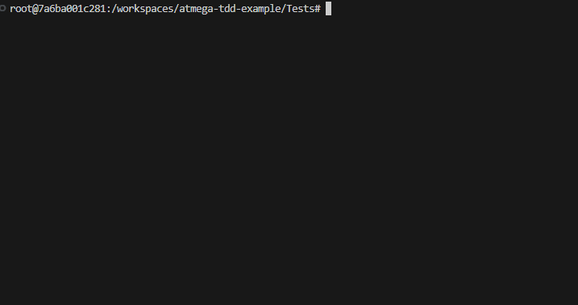

# ATmega TDD Example


This project demonstrates the use of unit testing and test-driven development
(TDD) when writing bare-metal code for an ATmega series microcontroller.

Ceedling ([ThrowTheSwitch/Ceedling](https://github.com/ThrowTheSwitch/Ceedling))
is used as the unit testing framework, but the codebase can easily be adapted
to accommodate other testing frameworks such as CppUTest or Google Test.

In this example, the unit tests are run exclusively on the developer's machine
(the "host") instead of on the microcontroller itself (the "target"). To
streamline this process among developers, the project uses a Docker environment
described below (see [running unit tests](#running-unit-tests)).

## Required Hardware

1. Breadboard
2. Microcontroller (ATmega168A, 28-PDIP Package)
3. LED
4. Current-limiting resistor
5. Programmer (e.g. Pololu USB AVR Programmer v2.1)
6. Some jumper wires

Details on how to connect these components can be found in
```Docs/schematic.pdf```.

## Running unit tests manually

This project uses a Dockerized environment from within which the unit tests can
be executed. This saves developers from having to set up the development
environment themselves on their local workstations.

First, make sure that you have [Docker](https://www.docker.com/get-started/)
installed and running on your machine. Next, install and activate the
[Dev Containers](https://marketplace.visualstudio.com/items?itemName=ms-vscode-remote.remote-containers)
extension for [Visual Studio Code](https://code.visualstudio.com/).

Opening the workspace in Visual Studio Code should then prompt you with a
textbox that allows you to reopen the project in a Docker container with all
required packages already installed. From within the ```Tests/```
directory, you can then simply run:

```bash
ceedling test:all
```

All tests should pass successfully:



## VS Code Extension

As an alternative, you can also use run the unit tests directly from
within VS Code by using the [Ceedling Test Explorer](https://marketplace.visualstudio.com/items?itemName=numaru.vscode-ceedling-test-adapter) plugin. The plugin not only provides a convenient
interface to launch unit tests for individual models from, but also adds
integration of the GDB debugger.

## Further reading

- Grenning, J. W. (2011): *Test-Driven Development for Embedded C.* Raleigh, NC:
Pragmatic Programmers.
